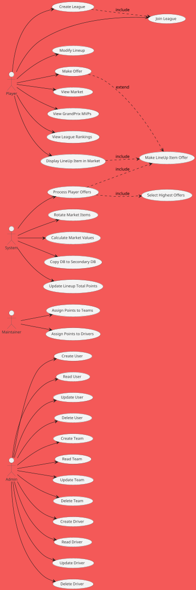
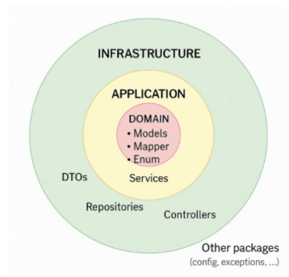
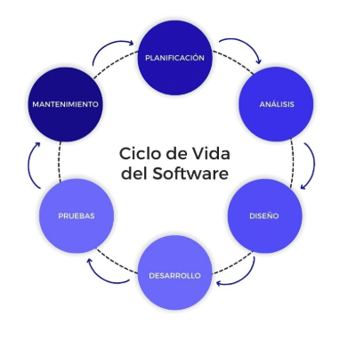

# PROYECTO INTEGRADO DAM

# 


**DESARROLLO DE APLICACIONES MULTIPLATAFORMA**

**Omar Lerma El Atrassi**


## **Resumen del proyecto**

El presente Trabajo de Fin de Ciclo consiste en el desarrollo de una aplicación web tipo Fantasy F1, donde los usuarios pueden gestionar alineaciones de pilotos y escuderías, competir en diferentes ligas y obtener puntuaciones basadas en el rendimiento real de la Fórmula 1. La aplicación está diseñada para simular la experiencia de gestión deportiva, fomentando la estrategia y la competencia entre usuarios.

### **Explicación de la Aplicación**

La aplicación incluye tres roles principales:

- **Admin**: Puede realizar operaciones CRUD sobre usuarios, pilotos y escuderías.


- **Reviewer**: Es el encargado de asignar los puntos obtenidos por pilotos y equipos tras cada carrera.


- **Player**: Puede unirse o crear ligas, gestionar sus alineaciones (una por liga), y consultar la alineación ***óptima por jornada o mvps***.


Los usuarios pueden formar parte de múltiples ligas, cada una con su propio sistema de puntuación y competencia.

### 
## **1. Resumen de tecnologías utilizadas**

- **Frontend**: React.js (HTML + CSS + JS ) <br><br>

  - React Router para la redirección mediante rutas de la página

  - Axios para la realización de peticiones a la API


- **Backend**: Java con Spring <br><br>

  - MapStruct para la generación de mappers para los distintos DTO’s de forma automática

  - Lombok para la generación de código boilerplate(constructores, getters, setters,etc,) de forma automática.
    
  - Swagger para la documentación de los endpoints, se deberá desactivar en producción
    
  - Procesos Batch para la realización de tareas por lotes(de gran carga que se realizan paso a paso)
    
  - Schedule para la automatización de tareas y procesos batch<br><br>

- **Base de datos relacional**:H2 


- **Autenticación**: JWT 


- **Control de versiones**: Git + GitHub 


- **Despliegue**: GitHub Pages(Frontend) + Firebase (Backend)

## **2. Especificación de Requisitos**

### **Requisitos funcionales**

- RF1: El sistema debe permitir a los usuarios registrarse e iniciar sesión.

- RF2: El admin puede crear, editar, eliminar y consultar pilotos, equipos y usuarios.

- RF3: El reviewer puede asignar puntos por jornada a pilotos y escuderías.

- RF4: Los usuarios pueden crear y unirse a ligas.

- RF5: Los usuarios pueden fichar pilotos y equipos para sus alineaciones.

- RF6: Los usuarios pueden poner en el mercado tanto pilotos como el equipo de su alineación.

- RF8: El sistema ofrecerá una oferta por los elementos en el mercado de un usuario, SIEMPRE

- RF9: El sistema debe calcular automáticamente los valores de mercado de los equipos y pilotos

- RF10: El sistema debe seleccionar el ganador de las pujas de los pilotos y escuderías

- RF11: El sistema debe asignar una alineación inicial cuando el usuario se une a una liga.

- RF12: El sistema debe rotar los pilotos y equipos que se van mostrando en el mercado (se mostrarán mercados con pilotos y equipos que estén disponibles)

- RF13: Se deberá enviar al usuario un correo para activar la cuenta y este enlace será temporal

- RF14: El usuario tendrá la posibilidad de reenviar el correo en caso de que el enlace caduque

- RF15: Los usuarios podrán ver los pilotos y el equipo que más puntos hayan conseguido durante una jornada

- RF16: Los usuarios podrán consultar los rankings de las ligas a las que pertenecen


### **Requisitos no funcionales**

- RNF1:  El sistema debe garantizar la seguridad de la autenticación mediante tokens JWT y los datos sensibles como contraseñas serán encriptados.

- RNF2: El sistema debe seguir un patrón de arquitectura limpio y modular.

- RNF3: El sistema volcará los datos de la BBDD principal sobre una BBDD secundaria.

- RNF4: El sistema eliminará los tokens de verificación caducados una vez a la semana.

- RNF5: El sistema ofrecerá una oferta siempre por los items propios de un usuario que estén en el mercado.
-
## **3. Diseño**


### Diagramas

#### Clases

````plantuml
@startuml
' --------------------------------------------------------
' Styles
' --------------------------------------------------------
left to right direction
skinparam linetype ortho
skinparam backgroundColor #f45958
skinparam dpi 150
skinparam nodesep 200        ' espacio mínimo entre nodos
skinparam ranksep 200        ' espacio mínimo entre niveles verticales
skinparam edgesep 150        ' espacio mínimo entre líneas que se cruzan
skinparam packageMargin 30   ' padding interno de cada paquete

skinparam class {
    BackgroundColor #F4F4F4
    BorderColor #555555
    FontName Arial
    FontSize 12
    FontColor #333333
    AttributeFontColor #333333
    Padding 20              ' espacio entre contenido y borde
}

skinparam Arrow {
    Color #555555
    Thickness 1
    FontSize 12
}

' --------------------------------------------------------
' Diagram
' --------------------------------------------------------
package "Users & Security" as US {
    class Account {
        + Long id
        + String username
        + String email
        + String password
        + Boolean active
        + Set<Role> roles
    }
    class Role
    class AppUser {
        + Long id
    }

    Account --> Role     : 1 .. *
    Account -- AppUser  : 1 .. 1
}

package "Auctionable Entities" as AE {
    abstract class AuctionableEntity {
        + Long id
        + Long price
        + Long points
        + Long previousPoints
        + Boolean active
        + String nationality
        + String imageUrl
    }
    class Driver {
        + String name
    }
    class Team {
        + String name
    }

    Driver -- AuctionableEntity : 1 .. 1
    Team   -- AuctionableEntity : 1 .. 1
}

package "League & Market" as LM {
    class League {
        + Long id
        + String name
    }
    class Market {
        + Long id
    }
    class MarketItem {
        + Long id
        + Boolean available
    }
    class Offer {
        + Long id
        + Boolean buy
        + Long price
        + LocalDateTime timestamp
    }

    League            -- Market         : 1 .. 1
    League            --> MarketItem     : 1 .. *
    Market            --> MarketItem     : 1 .. *
    AuctionableEntity --> MarketItem     : 1 .. *
    AppUser           --> Offer          : 1 .. *
    MarketItem        --> Offer          : 1 .. *
}

package "LineUp & Budget" as LB {
    class LineUp {
        + Long id
        + Long totalPoints
    }
    class Budget {
        + Long id
        + Long amount
    }

    AppUser --> LineUp   : 1 .. *
    League  --> LineUp   : 1 .. *
    Team    --> LineUp   : 1 .. *
    Driver  --> LineUp   : 1 .. *

    AppUser --> Budget   : 1 .. *
    League  --> Budget   : 1 .. *
}

US -[hidden]-> AE
AE -[hidden]-> LM
LM -[hidden]-> LB

@enduml
````

#### E-R

````plantuml
@startuml
' --------------------------------------------------------
' Styles
' --------------------------------------------------------
left to right direction
skinparam linetype ortho
skinparam backgroundColor #f45958
skinparam dpi 150
skinparam nodesep 200
skinparam ranksep 200
skinparam edgesep 150

skinparam entity {
    BackgroundColor #F4F4F4
    BorderColor #555555
    FontName Arial
    FontSize 12
    FontColor #333333
    AttributeFontColor #333333
    Padding 20
}

skinparam Arrow {
    Color #555555
    Thickness 1
    FontSize 12
}

' --------------------------------------------------------
' Entities
' --------------------------------------------------------
entity "ACCOUNT" as ACCOUNT {
  * id : LONG
  --
  username : VARCHAR
  email    : VARCHAR
  password : VARCHAR
  active   : BOOLEAN
}

entity "ROLE" as ROLE {
  * name : VARCHAR
}

entity "APP_USER" as APP_USER {
  * id : LONG
}

entity "AUCTIONABLE_ENTITY" as AE {
  * id             : LONG
  --
  price           : BIGINT
  points          : BIGINT
  previous_points : BIGINT
  active          : BOOLEAN
  nationality     : VARCHAR
  image_url       : VARCHAR
  type            : VARCHAR
}

entity "DRIVER" as DRIVER {
  * id   : LONG
  --
  name : VARCHAR
}

entity "TEAM" as TEAM {
  * id   : LONG
  --
  name : VARCHAR
}

entity "LEAGUE" as LEAGUE {
  * id   : LONG
  --
  name : VARCHAR
}

entity "MARKET" as MARKET {
  * id : LONG
}

entity "MARKET_ITEM" as MARKET_ITEM {
  * id        : LONG
  --
  available  : BOOLEAN
}

entity "OFFER" as OFFER {
  * id        : LONG
  --
  buy        : BOOLEAN
  price      : BIGINT
  timestamp  : TIMESTAMP
}

entity "LINE_UP" as LINE_UP {
  * id           : LONG
  --
  total_points  : BIGINT
}

entity "BUDGET" as BUDGET {
  * id     : LONG
  --
  amount : BIGINT
}

' --------------------------------------------------------
' 1:N y 1:1
' --------------------------------------------------------
ACCOUNT    -- APP_USER    : 1 : 1
APP_USER   --> LINE_UP     : 1 : N
APP_USER   --> BUDGET      : 1 : N
APP_USER   --> OFFER       : 1 : N
LEAGUE     --> LINE_UP     : 1 : N
LEAGUE     --> BUDGET      : 1 : N
LEAGUE     -- MARKET      : 1 : 1
OFFER      <-- MARKET_ITEM : N : 1
LINE_UP    <-- TEAM        : N : 1
MARKET_ITEM <-- AE         : N : 1

' --------------------------------------------------------
' N:M
' --------------------------------------------------------
ACCOUNT    <--> ROLE        : N:M
LINE_UP    <--> DRIVER      : N:M
MARKET     <--> MARKET_ITEM : N:M

' --------------------------------------------------------
' Inheritance
' --------------------------------------------------------
AE         <|-- DRIVER
AE         <|-- TEAM

ACCOUNT -[hidden]-> AE
AE      -[hidden]-> LEAGUE
LEAGUE  -[hidden]-> LINE_UP

@enduml
````

#### Casos de uso



### **Patrón de diseño**

Para el backend se usará el patrón de diseño hexagonal

- Domain: la lógica del negocio, lo que es menos probable que cambie, como repositorios JPA, entidades, mappers,etc,.

- Application: Se encarga de gestionar las operaciones sobre las entidades, empleando para ello la capa domain (entidades, repositorios)

- Infrastructure: Se encarga del resto y que es externo a la lógica de negocio per se, tratar peticiones usando controllers, albergar DTO’s, gestionar peticiones a otros back usando RestTemplate por ejemplo,etc.

Todo esto trabajado con la capa de application y a su vez por definición con la de domain.



### **Decisiones de diseño**

**ROLES**

He tomado la decisiones de que no exista una jerarquía de roles per sé, con esto me refiero a que, por ejemplo, el rol **ADMIN** no será capaz de realizar las cosas que realiza un **REVIEWER** o un **PLAYER**,  que una cuenta pueda realizar las actividades de **ADMIN** y **REVIEWER** deberá poseer ambos roles. 


**BORRADO LÓGICO**

Borrado lógico de usuarios y contenido, los usuario y contenido no serán eliminados totalmente puesto que los usuarios podrán seguir reactivando la cuenta sin que las plantillas dentro de las respectivas ligas se vean afectadas y por tanto no afectarán al resto de usuarios. 

Respecto a los contenidos simplemente serán desactivados ya que existe la posibilidad de que un piloto se lesione y esté fuera temporalmente, que se vayan turnando pilotos, que un equipo abandone la F1 y luego vuelva a participar,etc,. Esto se realiza con el fin de evitar la creación de ítems excesiva, ya que es más simple buscar el item y reactivarlo.

## **4. Endpoints**

Los endpoints se encuentran documentados en la url, aunque en una teórica subida a producción este endpoint no debería ser accesible en producción:

[http://localhost:8080/swagger-ui/index.html](http://localhost:8080/swagger-ui/index.html)

Incluyendo ejemplos de peticiones y DTO’s


## **5. Documentación del código**

Este apartado documentará las secciones más destacables del código.

### **Proceso Batch:**

> [!NOTE]
>
>Un proceso **Batch** es un conjunto de tareas automatizadas que procesan grandes volúmenes de datos de manera secuencial o periódica, sin interacción del usuario. Se ejecutan en "lotes" y son ideales para trabajos de larga duración. Como metáfora se podría afirmar que  \

> [!TIP]
>
>***“Un proceso batch es una especie de Big Data a nivel de backend”***

Uso en el proyecto: 


> [!NOTE]
>
>El ***Reader*** es responsable de leer los datos desde la base de datos primaria utilizando una consulta SQL. En este caso, se emplea un JdbcCursorItemReader que ejecuta una consulta para obtener datos de dos tablas: MARKET_ITEM y AUCTIONABLE_ENTITY.

Los resultados de la consulta se mapean a un DTO (MarketItemJoin) para facilitar el procesamiento posterior

```java
@Bean
    public JdbcCursorItemReader<MarketItemJoin> readerMarketItem(@Qualifier("primaryDatasource") DataSource dataSource) {
        JdbcCursorItemReader<MarketItemJoin> reader = new JdbcCursorItemReader<>();
        reader.setDataSource(dataSource);
        reader.setSql(
                "SELECT " +
                        "  mi.id                    AS mi_id, " +
                        "  mi.available             AS mi_available, " +
                        "  ae.id                    AS ae_id, " +
                        "  ae.type                  AS ae_type " +
                        "FROM MARKET_ITEM mi " +
                        "JOIN AUCTIONABLE_ENTITY ae ON mi.auctionable_entity_id = ae.id"
        );
        reader.setRowMapper((rs, rowNum) -> {
            MarketItemJoin temp = new MarketItemJoin();
            temp.setId(rs.getLong("mi_id"));
            temp.setAvailable(rs.getBoolean("mi_available"));
            temp.setAeId(rs.getLong("ae_id"));
            temp.setAeType(rs.getString("ae_type"));
            return temp;
        });
        return reader;
    }
```
> [!NOTE]
>
>El ***Processor*** toma el DTO leído en el Reader y lo transforma en una entidad que será finalmente persistida en la base de datos secundaria. Aquí, el ItemProcessor convierte el objeto MarketItemJoin a una entidad de tipo MarketItem, y si es necesario, también crea un objeto de tipo AuctionableEntity que puede ser una subclase de Driver o Team, dependiendo del tipo de entidad (aeType)

```java
@Bean
    public ItemProcessor<MarketItemJoin, ptzt.f1Hub.domain.models.copy.market.MarketItem> processorMarketItemToMarketItem() {
        return original -> {
            ptzt.f1Hub.domain.models.copy.market.MarketItem copy = new ptzt.f1Hub.domain.models.copy.market.MarketItem();
            copy.setId(original.getId());
            copy.setAvailable(original.getAvailable());

            if (original.getAeId() != null) {
                // Creamos la subclase concreta en función del type
                ptzt.f1Hub.domain.models.copy.AuctionableEntity auctRef;
                if ("DRIVER".equalsIgnoreCase(original.getAeType())) {
                    auctRef = new ptzt.f1Hub.domain.models.copy.Driver();
                } else {
                    auctRef = new ptzt.f1Hub.domain.models.copy.Team();
                }
                auctRef.setId(original.getAeId());
                copy.setAuctionableEntity(auctRef);
            }
            return copy;
        };
    }
```

> [!NOTE]
>
>El ***Writer*** se encarga de persistir los datos procesados en la base de datos secundaria. En este caso, el JdbcBatchItemWriter utiliza una sentencia MERGE INTO para insertar o actualizar los registros en la tabla MARKET_ITEM.

La sentencia SQL es preparada con los valores correspondientes para cada campo.

```java
@Bean
    public JdbcBatchItemWriter<ptzt.f1Hub.domain.models.copy.market.MarketItem> writerMarketItem(
            @Qualifier("secondaryDatasource") DataSource dataSource) {
        JdbcBatchItemWriter<ptzt.f1Hub.domain.models.copy.market.MarketItem> writer = new JdbcBatchItemWriter<>();
        writer.setDataSource(dataSource);
        writer.setSql(
                "MERGE INTO MARKET_ITEM (id, available, auctionable_entity_id) " +
                        "KEY(id) VALUES (?, ?, ?)"
        );
        writer.setItemPreparedStatementSetter((item, ps) -> {
            ps.setLong(1, item.getId());
            if (item.getAvailable() != null) {
                ps.setObject(2, item.getAvailable());
            } else {
                ps.setNull(2, java.sql.Types.BIT);
            }
            if (item.getAuctionableEntity() != null) {
                ps.setLong(3, item.getAuctionableEntity().getId());
            } else {
                ps.setNull(3, java.sql.Types.BIGINT);
            }
        });
        return writer;
    }
```
### 
### **Schedules**

> [!NOTE]
>
>Una ***Scheduled Task*** es una acción o proceso que se ejecuta automáticamente en intervalos específicos o en momentos predeterminados, sin necesidad de intervención manual.

Uso en el proyecto:

- **Automatización de copia de BBDD a una BBDD secundaria**

Automatiza el servicio batch detallado arriba

```java
@Scheduled(cron = "0 0 0 * * *")
    public void copyToSecondaryDataBase() throws Exception {

        jobLauncher.run(copyEntitiesJob, new JobParametersBuilder()
                .addLong("time", System.currentTimeMillis())
                .toJobParameters());

    }
```
- **Automatización de eliminación de los token no válidos**

```java
@Scheduled(cron = "0 0 0 * * *")
    public void deleteInvalidVerificationToken(){
        verificationTokenService.deleteAllExpiredTokens();
    }
```
***deleteAllExpireTokens*** en ***VerificationTokenService*** \


```java
@Override
public long deleteAllExpiredTokens() {

  return verificationTokenRepository.deleteByUsedFalseAndExpiresAtBefore(LocalDateTime.now());

    }
```

- **Automatización de la finalización de las subastas del mercado**

> [!NOTE]
>
>Se encarga de finalizar la subastas que afectan a los items del mercado, en caso de que las ofertas sean iguales ganará la que se haya realizado antes.

```java
@Scheduled(cron = "0 0 0 * * *")
    @Transactional
    public void finalizeAuction() {

        //EFEUNO USER
        AppUser systemUser = appUserService.getByAccount(
                accountService.getByEmail("efeuno.hub@gmail.com")
        );

        // MAP <LEAGUE , MAP<MARKET ITEM, BEST OFFER>>
        Map<League, Map<MarketItem, Offer>> results = marketService.finalizeAuction();

        results.forEach((league, itemOfferMap) -> {

            // ALL LINEUPS BY LEAGUE
            List<LineUp> leagueLineUps = lineUpService
                    .getAllByLeague(Pageable.unpaged(), league)
                    .getContent();

            itemOfferMap.forEach((marketItem, winningOffer) -> {
                AuctionableEntity entity = marketItem.getAuctionableEntity();
                AppUser buyer = winningOffer.getAppUser();
                long amount = winningOffer.getAmount();

                //GET SELLER
                Optional<LineUp> sellerLineUpOpt = leagueLineUps.stream()
                        .filter(lu -> isEntityInLineUp(entity, lu))
                        .findFirst();

                //PROCESS SELLER
                sellerLineUpOpt.ifPresent(sellerLu -> {
                    AppUser seller = sellerLu.getAppUser();
                    boolean isSystemSeller = seller.getAccount().getEmail()
                            .equalsIgnoreCase(systemUser.getAccount().getEmail());

                    //REMOVE ITEM FROM SELLER LINEUP
                    if (entity instanceof Driver) {
                        sellerLu.getDrivers().remove((Driver) entity);
                    } else {
                        sellerLu.setTeam(null);
                    }
                    lineUpService.update(sellerLu);

                    if (!isSystemSeller) {

                        //WHEN ITS NOT EFEUNO USER

                        //INCREASE THE SELLER BUDGET WITH OFFER VALUE
                        Budget sellerBudget = seller.getBudgets().stream()
                                .filter(b -> b.getLeague().equals(league))
                                .findFirst()
                                .orElseThrow(() -> new RuntimeException(
                                        "No budget for seller " + seller.getId()
                                ));
                        sellerBudget.setBudgetValue(
                                sellerBudget.getBudgetValue() + amount
                        );
                        budgetService.update(sellerBudget);
                    }
                });

                //PROCESS BUYER
                boolean isSystemBuyer = buyer.getAccount().getEmail()
                        .equalsIgnoreCase(systemUser.getAccount().getEmail());
                if (!isSystemBuyer) {

                    //WHEN ITS NOT EFEUNO USER

                    //DECREASE THE BUYER BUDGET WITH OFFER VALUE
                    Budget buyerBudget = buyer.getBudgets().stream()
                            .filter(b -> b.getLeague().equals(league))
                            .findFirst()
                            .orElseThrow(() -> new RuntimeException(
                                    "No budget for buyer " + buyer.getId()
                            ));
                    buyerBudget.setBudgetValue(
                            buyerBudget.getBudgetValue() - amount
                    );
                    budgetService.update(buyerBudget);

                    //ADD ITEM TO LINEUP
                    LineUp buyerLu = lineUpService.getByAppUserAndLeague(buyer, league);
                    if (entity instanceof Driver) {
                        buyerLu.getDrivers().add((Driver) entity);
                    } else {
                        buyerLu.setTeam((Team) entity);
                    }
                    lineUpService.update(buyerLu);
                }

                //ITEM NOT AVAILABLE SO DON'T APPEAR MORE AT MARKET
                marketItem.setAvailable(false);
                marketItem.getMarkets().clear();
                marketItemRepository.save(marketItem);

                log.info(
                        "League={} | Item={} sell by={} bought by={} for {}",
                        league.getName(),
                        entity.getId(),
                        sellerLineUpOpt.isPresent() ? sellerLineUpOpt.get().getId() : "EFEUNO.HUB",
                        buyer.getAccount().getEmail().equals("efeuno.hub@gmail.com") ? "EFEUNO.HUB" : buyer.getId(),
                        amount
                );
            });
        });

        log.info("===============================");
        log.info("ALL AUCTIONS HAVE BEEN FINISHED");
        log.info("===============================");

    }


    private boolean isEntityInLineUp(AuctionableEntity entity, LineUp lu) {
        if (entity instanceof Team) {
            return lu.getTeam() != null
                    && lu.getTeam().getId().equals(entity.getId());
        } else {
            return lu.getDrivers().stream()
                    .map(AuctionableEntity::getId)
                    .anyMatch(id -> id.equals(entity.getId()));
        }
    }
```

- **Automatización de la actualización del valor de los pilotos y equipos**

> [!NOTE]
> 
>Para calcular los valores de de los equipos y pilotos se utiliza el el método ***updateValue*** definido tanto en ***DriverService*** como en ***TeamService***

```java
   @Scheduled(cron = "0 0 0 * * *")
    public void calculateTeamsValue(){

        teamService.getAll().forEach(teamService::updateValue);
        log.info("=================================");
        log.info("All Teams values has been updated");
        log.info("=================================");

    }

    @Scheduled(cron = "0 0 0 * * *")
    public void calculateDriversValue(){

        driverService.getAll().forEach(driverService::updateValue);
        log.info("===================================");
        log.info("All Drivers values has been updated");
        log.info("===================================");

    }
```
***updateValue()*** en ***TeamService***

```java
   @Transactional
    @Override
    public void updateValue(Team team) {
        if (team.getPreviousPoints() == 0) return;
        long diff = team.getPoints() - team.getPreviousPoints();
        double factor = (double) diff / team.getPreviousPoints();
        team.setPrice(Math.round(team.getPrice() + team.getPrice() * factor));
        teamRepository.save(team);
    }
```

***updateValue()*** en ***DriverService***

```java
   @Transactional
    @Override
    public void updateValue(Driver driver) {

        if (driver.getPreviousPoints() == 0)
            return;

        long pointsDifference = driver.getPoints() - driver.getPreviousPoints();

        double priceChangeFactor =  pointsDifference * 1.0 / driver.getPreviousPoints();

        driver.setPrice(Math.round(driver.getPrice() + (driver.getPrice() * priceChangeFactor)));

    }
```
- **Automatización de la actualización de los puntos de las plantillas existentes**
> [!NOTE]
> 
>Los puntos de los distintos items son seteados desde el front, por un usuario de tipo **_REVIEWER_**, y en base a los puntos de los items son seteados los puntos de las plantillas.

```java
@Scheduled(cron = "0 59 23 * * 1")
    public void calculateLineUpPoints(){

        lineUpService.getAll().forEach(lineUp -> {

            if (lineUp.getTeam() != null || lineUp.getDrivers().size() == 2){
                lineUp.setTotalPoints(lineUp.getTotalPoints() + (lineUp.getTeam().getPoints() - lineUp.getTeam().getPreviousPoints()));

                lineUp.getDrivers().forEach(driver -> lineUp.setTotalPoints(lineUp.getTotalPoints() + (driver.getPoints() - driver.getPreviousPoints())));

                lineUpService.update(lineUp);
            }

        });
        log.info("====================================");
        log.info("All LineUps points have been updated");
        log.info("====================================");
    }
```
- **Automatización de la actualización de los items del mercado**


> [!NOTE]
> 
>Se incorporan nuevos elementos del mercado una vez se inicia el back y diariamente a la 00:00. Para ello se ocultan los elementos disponibles que no son parte de ninguna plantilla y se seleccionan los items disponibles que tampoco pertenezcan a ninguna plantilla, tras esto se reorganizan aleatoriamente y se toman hasta 7 elementos y se muestran en el mercado.

>Los mercados serán distintos por cada liga

```java
private final MarketItemService marketItemService;


@EventListener(ApplicationReadyEvent.class)
@Transactional
public void setUpMarketOnStartup() {

   marketItemService.updateMarketItems();

    }

@Scheduled(cron = "0 0 0 * * *")
@Transactional
public void setUpMarketDaily() {

    marketItemService.updateMarketItems();

    }
```
***updateMarketItems()*** en ***MarketItemService***

```java
@Override
public void updateMarketItems() {
  List<Market> markets   = marketService.getAll();
  List<MarketItem> allItems = getAll().stream().filter(marketItem -> marketItem.getAuctionableEntity().getActive()).toList();
  if (markets.isEmpty() || allItems.isEmpty()) return;

  for (Market market : markets) {
    League league = market.getLeague();

    //Items part of any lineup
    Set<MarketItem> lockedItems = allItems.stream()
            .filter(mi -> isInLineUp(mi, league))
            .collect(Collectors.toSet());

    //Hide items in market that are not part of any lineup
    List<MarketItem> currentlyVisible = allItems.stream()
            .filter(mi -> mi.getMarkets().contains(market))
            .filter(mi -> !lockedItems.contains(mi))
            .toList();
    currentlyVisible.forEach(mi ->
            hideInMarket(mi, List.of(market))
    );

    //Select the available items
    List<MarketItem> candidates = allItems.stream()
            .filter(mi -> !mi.getMarkets().contains(market))
            .filter(mi -> !lockedItems.contains(mi))
            .collect(Collectors.toList());

    //Shuffle to get random item into market
    Collections.shuffle(candidates);
    Set<MarketItem> toDisplay = new HashSet<>(
            candidates.subList(0, Math.min(ITEMS_PER_MARKET, candidates.size()))
    );
    toDisplay.forEach(mi ->
            displayInMarket(mi, List.of(market))
    );
  }
}


private boolean isInLineUp(MarketItem mi, League league) {
  var entity = mi.getAuctionableEntity();
  if (entity instanceof Driver driver) {
    return driver.getLineUps().stream()
            .anyMatch(lu -> lu.getLeague().getId().equals(league.getId()));
  } else if (entity instanceof Team team) {
    return team.getLineUps().stream()
            .anyMatch(lu -> lu.getLeague().getId().equals(league.getId()));
  }
  return false;
}
```
### 
### **Envío de correo de activación de cuenta**

Se envían correos para la activación de cuentas recién registradas, además existe la posibilidad de realizar reenvíos de activación en caso de que el enlace haya caducado.

Servicio de envío de mails utilizado en otros servicios

```java
private final JavaMailSender mailSender;
    private final SpringTemplateEngine templateEngine;

    private final static String ACTIVATION_EMAIL_TEMPLATE = "verification_email.html";

    @Override
    public void sendVerificationEmail(Account account, String token) {
        MimeMessage mimeMessage = mailSender.createMimeMessage();

        try {
            MimeMessageHelper helper = new MimeMessageHelper(mimeMessage, true, "UTF-8");
            helper.setFrom("efeuno.hub@gmail.com");
            helper.setTo(account.getEmail());
            helper.setSubject("Activate your account");
            helper.setText(processVerificationTemplate(account.getUsername(), token), true);

            mailSender.send(mimeMessage);

        } catch (MessagingException ex) {
            log.error(ex.getMessage());
            throw new RuntimeException(ex);
        }
    }

    private String processVerificationTemplate(String user, String token) {
        Map<String, Object> model = new HashMap<>();
        model.put("username", user);
        model.put("activationUrl", "http://localhost:5173/activate/" + token);

        Context context = new Context();
        context.setVariables(model);

        return templateEngine.process(ACTIVATION_EMAIL_TEMPLATE, context);
    }
```
Servicio encargado de la gestión y verificación de token de verificación de cuentas

```java
@Override
    public VerificationToken creteToken(Account account) {

        VerificationToken verificationToken = VerificationToken.builder()
                .token(UUID.randomUUID().toString())
                .expiresAt(LocalDateTime.now().plusMinutes(30))
                .account(account)
                .used(false)
                .build();

        return verificationTokenRepository.save(verificationToken);

    }

    @Override
    @Transactional
    public Account verifyToken(String token) {

        VerificationToken verificationToken = verificationTokenRepository.findByToken(token)
                .orElseThrow(() -> new BadRequestException("Token not found"));

        if (verificationToken.isUsed())
            throw new BadRequestException("Token is used");

        if (verificationToken.getExpiresAt().isBefore(LocalDateTime.now()))
            throw new BadRequestException("Token is expired");

        verificationToken.setUsed(true);
        verificationToken.setConfirmedAt(LocalDateTime.now());
        verificationTokenRepository.save(verificationToken);

        return verificationToken.getAccount();
    }

    @Override
    public void invalidateAllTokensForUser(Account account) {

        List<VerificationToken> tokens = verificationTokenRepository.findByAccountId(account.getId());
        tokens.forEach(token -> token.setUsed(true));
        verificationTokenRepository.saveAll(tokens);

    }
```
Parte de ***AccountService*** es el encargado de coordinar los Servicios, detallados arriba, para el envío y verificación de tokens

```java
@Override
    public void verify(String token) {

        Account account = verificationTokenService.verifyToken(token);
        account.setActive(true);
        update(account);

    }

    @Override
    public void resendVerification(String email) {

        Account account = getByEmail(email);

        if (account.isActive())
            throw new BadRequestException("Account already verified");

        verificationTokenService.invalidateAllTokensForUser(account);

        mailService.sendVerificationEmail(account, verificationTokenService.creteToken(account).getToken());


    }
```

### **Tratamiento de excepciones**

Las excepciones son tratadas mediante un Componenete con la anotación *RestControllerAdvice*, en mi caso, ***GlobalExceptionHandler***.

Este es el encargado de capturar las excepciones lanzadas por el código y devolver un ResponseEntity con código de error, para ello es necesario especificar la excepción que se pretende capturar mediante la etiquete *ExceptionHandler* 

```java
@RestControllerAdvice
public class GlobalExceptionHandler extends ResponseEntityExceptionHandler {

    @ExceptionHandler({EntityNotFoundException.class, OffersNotAvailableException.class})
    public ResponseEntity<ErrorResponseDto> handleNotFoundErrors(Exception e){

        return ResponseEntity.status(404)
                .body(
                        new ErrorResponseDto(404, LocalDateTime.now(), e.getMessage())
                );

    }

    @ExceptionHandler({UnproccesableEntityException.class, BadRequestException.class})
    public ResponseEntity<ErrorResponseDto> handleBadRequestErrors(Exception e){

        return ResponseEntity.status(400)
                .body(
                        new ErrorResponseDto(400, LocalDateTime.now(), e.getMessage())
                );

    }

    @ExceptionHandler({InvalidTokenException.class, AuthenticationException.class, AccountNotActiveException.class})
    public ResponseEntity<ErrorResponseDto> handleUnauthorizedErrors (Exception ex){
        return ResponseEntity.
                status(HttpStatusCode.
                        valueOf(401)).
                body((new ErrorResponseDto(401, LocalDateTime.now(), ex.getMessage())));
    }

    @ExceptionHandler(UserUnauthorizedException.class)
    public ResponseEntity<ErrorResponseDto> handleUserUnauthorizedException (UserUnauthorizedException ex){

        //Se controla que se lance la excepción por falta de permisos, en caso positivo se asigna como codigo de status
        //de la respuesta 403 - Forbidden, en caso contrario 401 - Unauthorized
        int status = ex.getMessage().toLowerCase().contains("authority") ? 403 : 401;

        return ResponseEntity.
                status(HttpStatusCode.
                        valueOf(status)).
                body((new ErrorResponseDto(status, LocalDateTime.now(), ex.getMessage())));
    }

    @Override
    protected ResponseEntity<Object> handleMethodArgumentNotValid(MethodArgumentNotValidException ex, HttpHeaders headers, HttpStatusCode status, WebRequest request) {
        return ResponseEntity.
                status(HttpStatusCode.
                        valueOf(400)).
                body((new ErrorResponseDto(400, LocalDateTime.now(),String.format("Formato de la petición no valida: %s",
                        ex.getAllErrors()
                                .stream()
                                .map(DefaultMessageSourceResolvable::getDefaultMessage)
                                .toList()))));
    }
}

```

## **6. Manual de usuario**

Manual de usuario en la ruta [https://lermaomar.github.io/F1Hub-Front/#/docs/introduction](https://lermaomar.github.io/F1Hub-Front/#/docs/introduction)

## **7. Conclusiones**

### **Dificultades**

- La principal dificultad que he discernido durante el desarrollo de la aplicación es el diseño de relación entre las entidades del backend, diseño de la BBDD, esto ya que el resto del funcionamiento depende de la interacción entre estas.


- La causa por la que creo que se me ha dificultado este apartado es porque no tenía demasiado claro cómo iba a funcionar la app. Por ejemplo tenía pensado un sólo mercado de ***jugadores/equipos*** común a todas las ligas pero esto es imposible ya que cada liga tiene distintos ***jugadores/equipos*** disponibles.


- Dejando de lado las dificultades de diseño y lo que conlleva, teniendo que  volver atrás múltiples vece en el ciclo de vida del software, otra dificultad principal ha sido el desarrollo del front, no tanto del lado de la funcionalidad sino del diseño(orientación de elementos en la página, estilos,etc,)

<br>
<br>



 
### **Mejoras**

- Evidentemente debido al perfil de programador que tengo, back, el front pese a no estar mal para las circunstancias de tiempo, perfil, etc, creo que el front podría verse mejor.


- Implementar las funcionalidades faltantes en el frontend.


- Implementar nuevas funcionalidad tales como la posibilidad de poder pagar cláusulas por los pilotos/equipos para poder fichar de forma unilateral.


- Implementar ReactNative en el frontend para poder realizar una aplicación multiplataforma, a nivel nativo.


- Hacer que las subastas de los ítems propios de una plantilla duren más que las subastas de los ítems que rotan periódicamente, con el fin de fomentar la interacción entre usuarios.


- Poder finalizar manualmente las subastas de los ítems propios de una plantilla aceptando una oferta realizada.


---

